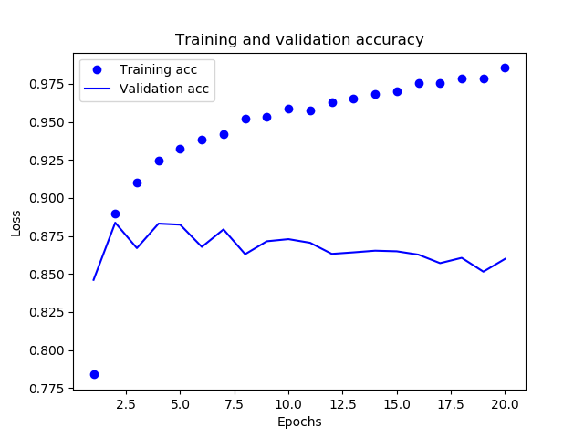
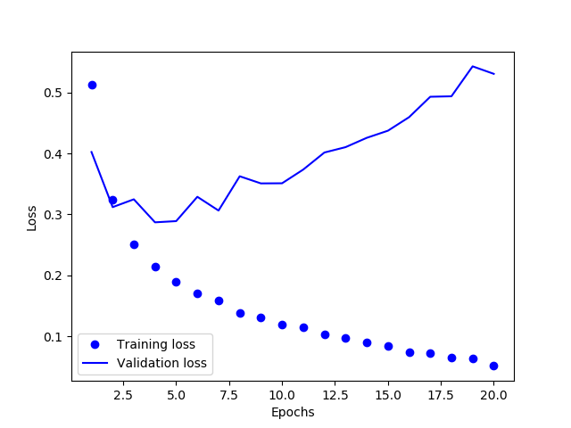
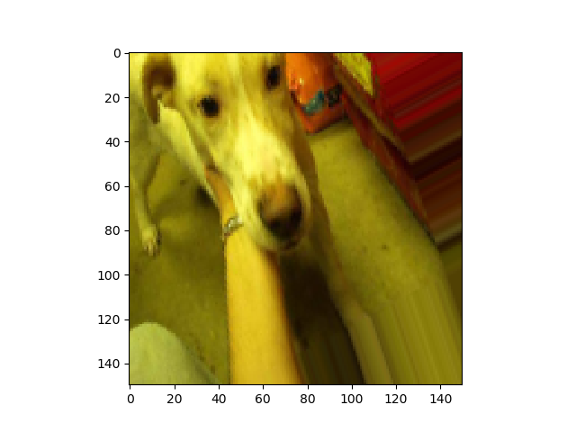
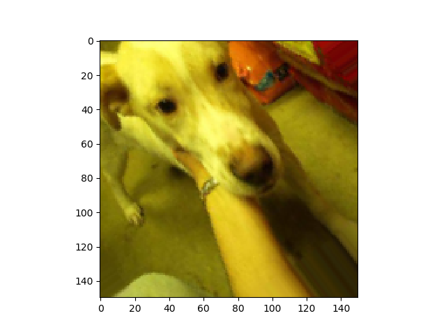
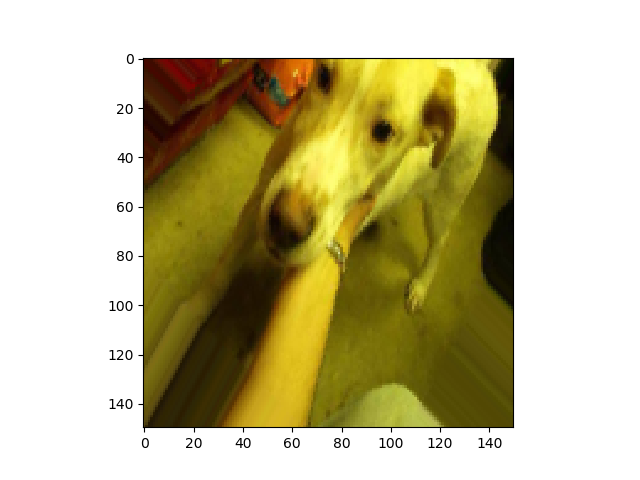
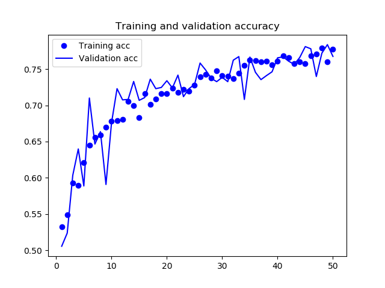
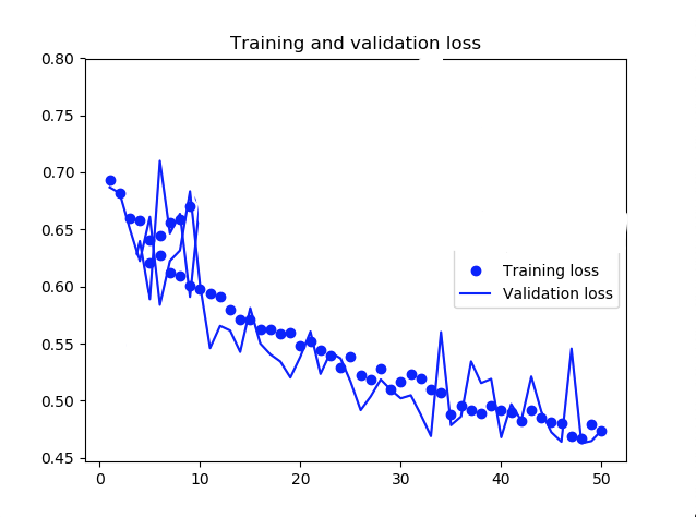
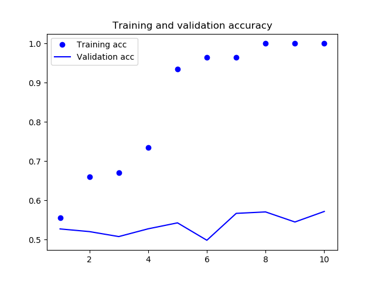
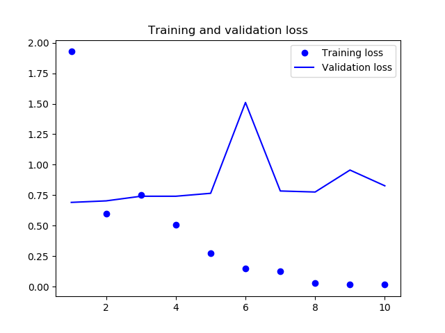

# Deep Learning with Python
In this book by Francois Chollet, he goes into detail about the applications of deep learning. Below are some examples from his book I worked through with Python.

## MNIST with Basic Neural Network (Chapter 2)
The Modified National Institute of Standards and Technology (MNIST) database is a database of handwritten digits largely used for training image processing systems - Wikipedia

We have the MNIST data set, and our task is to create a neural network to predict what numeric value is associated with the hand written digit (0-9). We created a neural network with two dense layers, compiled the network, fit the network on the training data, and evaluated the performance of the model using accuracy. The model ended with an accuracy of about 98%. Here is the code for the bulk of the model:

```python
model = models.Sequential()
model.add(layers.Dense(512, activation='relu', input_shape=(28*28,)))
model.add(layers.Dense(10, activation='softmax'))
model.compile(optimizer='rmsprop',
    loss='categorical_crossentropy',
    metrics=['accuracy'])

model.fit(x_train, y_train, epochs=5, batch_size=128)

test_loss, test_acc = model.evaluate(x_test, y_test)
```

This is a sequential model with two dense layers. The first dense layer has 512 hidden units, meaning there are 512 nodes within that layer, and each node is used to find patterns within the data. The activation function is 'relu'. Without the activation function, the layer could only learn linear transformations of the input data. By introducing the activation function, or non-linearity, more patterns and deeper representations are able to be found by the network. The input shape is the shape of the image of the handwritten digit.

Our final layer has ten hidden units, with a 'softmax' activation function. This is a 10-way sofmax layer, which means it will return an array of 10 probability scores (summing to 1). Each score will be the probability that the current handwritten digit images belongs to one of the 10 digit classes (0-9).

When we compile our network, we need to specify the optimizer and loss. The optimizer specifies the exact way in which the gradient of the loss will be used to update parameters. RMSProp and SGD are popular optimizers. The loss is the quantity we are trying to minimize during training, so it represents a measure of success.

Depending on the type of problem we are trying to solve, we need to customize our neural networks activation and loss functions. This is a rule-of-thumb table:

| Problem                 | Last-layer activation       | Loss function     |
| ----------------------- |:---------------------------:| -----------------:|
| Binary classification      | sigmoid | binary_crossentropy |
| Multiclass, single-label classification | softmax | categorical_crossentropy |
| Multiclass, multi-label classification | sigmoid | binary_crossentropy |
| Regression to arbitrary values | None | mse |
| Regression to values between 0 and 1 | sigmoid | mse or binary_crossentropy |

## Binary Classification of Movie Reviews (Chapter 3)
The Internet Movie Database (IMDB) is a collection of movie reviews. For this example, we will classify the movie reviews as positive or negative. The data set has been preprocessed, so the reviews have been turned into sequences of integers, where each integer stands for a specific word in a dictionary. If the data set was not preprocessed, another way to preprocess the data would be to use a bag-of-words approach (using either a term frequency or term frequency-inverse document frequency matrix).

The input data is movie reviews. Each movie review is preprocessed and represented as a sequence of integers. The target we are trying to predict is if the movie review is positive, which is represented as a '1', or if the movie review is negative, which is represented as a '0'. Here is the bulk of the network:

```python
# make network of layers
model = models.Sequential()
model.add(layers.Dense(16, activation='relu', input_shape=(5000,)))
model.add(layers.Dense(16, activation='relu'))
model.add(layers.Dense(16, activation='relu'))
model.add(layers.Dense(1, activation='sigmoid'))

# train/fit model
model.compile(optimizer='rmsprop',
                loss='binary_crossentropy',
                metrics=['acc'])
history = model.fit(partial_x_train,
                    partial_y_train,
                    epochs=20,
                    batch_size=512,
                    validation_data=(x_val, y_val)
                    )
```

The accuracy and loss results are below.





We can see the accuracy increasing and the loss decreasing when the model is run on the training data, but based on the validation data, the model is becoming overfit after only two or three epochs.

In this case, a model with three epochs will perform better than a model run over twenty epochs. To prevent overfitting, we can train the model on more training data. Another option is to add a dropout layer to our model, which is a regularization technique used in neural networks go mitigate overfitting.

*Two other problems I tackled with neural networks in chapter 3 were a multi-class classification problem involving classifying newswires into 40+ categories, and a regression problem involving predicting house prices.*

## Training a Convnet to Classify Pictures of Dogs and Cats (Chapter 5)

For this exercise, we utilized computer vision in order to classify pictures of dogs and cats. The goal was to use a convolutional neural network (convnet) on a set of images which consisted of dogs and cats, and have the convnet accurately classify which images were dogs, and which images were cats.

In order to generate more training data from the existing images we were using, we did some data augmentation. Data augmentation is a method to mitigate overfitting, and is done by randomly transforming the images we have. The new augmented images are variations of an image that have been stretched, zoomed, flipped, etc. Here is an example of data augmentation:

 |
:-------------------------:|:-------------------------:
|  


Without data augmentation, the trained convnet resulted in overfitting of the testing data. By using the augmented images, as well as adding a Dropout layer to the network, the convnet fit well to the test data. The bulk of the code is below.
* The Conv2D layer allows the model to pick-up on two-dimensional patterns of the data, which make convnets useful for image classification and computer vision.
* The MaxPooling2D layer downsamples feature maps (reducing coefficients), which makes the model more conductive to learning a spatial hierarchy of features. It also makes the model more computationally efficient.
* The Dropout layer is a regularization technique to prevent overfitting. Randomly selected neurons in the network are ignored during training, which will increase generality of the model.

```python
model = models.Sequential()
model.add(layers.Conv2D(32, (3,3), activation='relu',
                        input_shape=(150, 150, 3)))
model.add(layers.MaxPooling2D((2,2)))
model.add(layers.Conv2D(64, (3,3), activation='relu'))
model.add(layers.MaxPooling2D((2,2)))
model.add(layers.Conv2D(128, (3,3), activation='relu'))
model.add(layers.MaxPooling2D((2,2)))
model.add(layers.Conv2D(128, (3,3), activation='relu'))
model.add(layers.MaxPooling2D((2,2)))
model.add(layers.Flatten())
# add dropout layer to prevent overfitting
model.add(layers.Dropout(0.5))
model.add(layers.Dense(512, activation='relu'))
model.add(layers.Dense(1, activation='sigmoid'))

model.compile(loss='binary_crossentropy',
                optimizer=optimizers.RMSprop(lr=1e-4),
                metrics=['acc'])

                history = model.fit_generator(
                        train_generator,
                        steps_per_epoch=100,
                        epochs=50,
                        validation_data=validation_generator,
                        validation_steps=50)
```

Here we can see the model continues to increase accuracy and decrease loss over the epochs. This is a good sign.





Additionally, using a pre-trained convnet (such as VGG16), and replacing the last layer with the classification layer for dogs or cats should help increase the accuracy and decrease the loss of the model. By extracting features of the images using the pre-trained convolutional base, we can also increase the model predictions. We can do feature extraction with data augmentation (very computational expensive, but better results) or without data augmentation. When we are using a pre-trained convnet, it's important to freeze the convolutional base before we compile and train the model. This way the weights of the model are not updated unnecessarily (since we already have the weights we want in-place).

Convolutional neural networks are great of image processing and object detection.

## Using Deep Learning for Text and Sequences (Chapter 7)
In this chapter, we look at processing text, timeseries, and sequence data. The techniques used for this are applicable to many real-world scenarios, such as:
* **Document classification** (ID the topic of an article, or the author of a book)
* **Timeseries comparisons** (estimating how closely related things are, like documents, or stock tickers)
* **Sequence-to-sequence learning** (language translation)
* **Sentiment analysis** (classifying tweets or reviews as positive or negative)
* **Timeseries forecasting** (predicting the weather)

When we are working with text data, deep learning models cannot take in raw text, so the text must be preprocessed. This can be done a few ways.
* Transform each word of the vocabulary into a vector
* Transform each character into a vector
* Extract n-grams form words or characters, and transform each n-gram into a vector (this is better for shallow learning, such as regression and random forests)

Once we have the text vectorized, the deep learning networks can recognize patterns within the combination of vectors. This is just like how the deep learning networks recognize patterns within the combination of pixels in convnets.

Word vectors vs. word embeddings
* **Word vectors** - one-hot encoding words to create vectors. These vectors have to have the same length of the vocabulary, which can get long, so they end up being sparse, binary, high-dimensional, and hardcoded.
* **Word embeddings** - Can be of length *n*, so they are lower-dimensional. The values within the embeddings are floating-point, so the embeddings are dense, and the embeddings are learned from data, rather than hardcoded.

Just like with convnets, we can used pre-trained word embeddings if we don't have enough training data available to learn appropriate embeddings.
* Word2vec, developed by Tomas Mikolov at Google in 2013 is one example.
* Global Vectors for Word Representation (GloVe), developed by Stanford researchers in 2014, is another example, which we will use.

In this example, we only use 200 training samples. Once we preprocess our raw data and prepare the GloVe word-embedding matrix for the model, we are able to define the model.

```python
# define the model
model = Sequential()
model.add(Embedding(max_words, embedding_dim, input_length=maxlen))
model.add(Flatten())
model.add(Dense(32, activation='relu'))
model.add(Dense(1, activation='sigmoid'))
model.summary()

# load the GloVe matrix into the Embedding layer - the first layer
# we want to keep the same weights from the pretrained model, not update
# or train the weights, so we set the trainable attribute to false
model.layers[0].set_weights([embedding_matrix])
model.layers[0].trainable = False

# compile, train, and evaluate
model.compile(optimizer='rmsprop',
                loss='binary_crossentropy',
                metrics=['acc'])
history = model.fit(x_train, y_train,
                    epochs=10,
                    batch_size=32,
                    validation_data=(x_val, y_val))
```

We use the pre-trained model's weights (GloVe) as the first layer of the model, and do not update this layer. Let's have a look at the results.





Because of the minimal amount of training samples, we observe overfitting. The best way to remedy this would be to gather more training samples. When we did not use a pre-trained model for this same example, the validation accuracy was slightly lower than this model with the pre-trained weights. 
